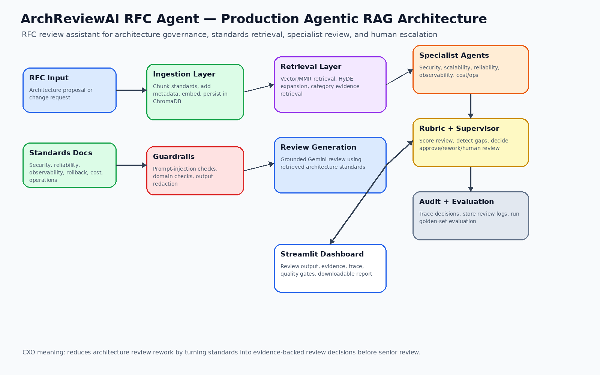
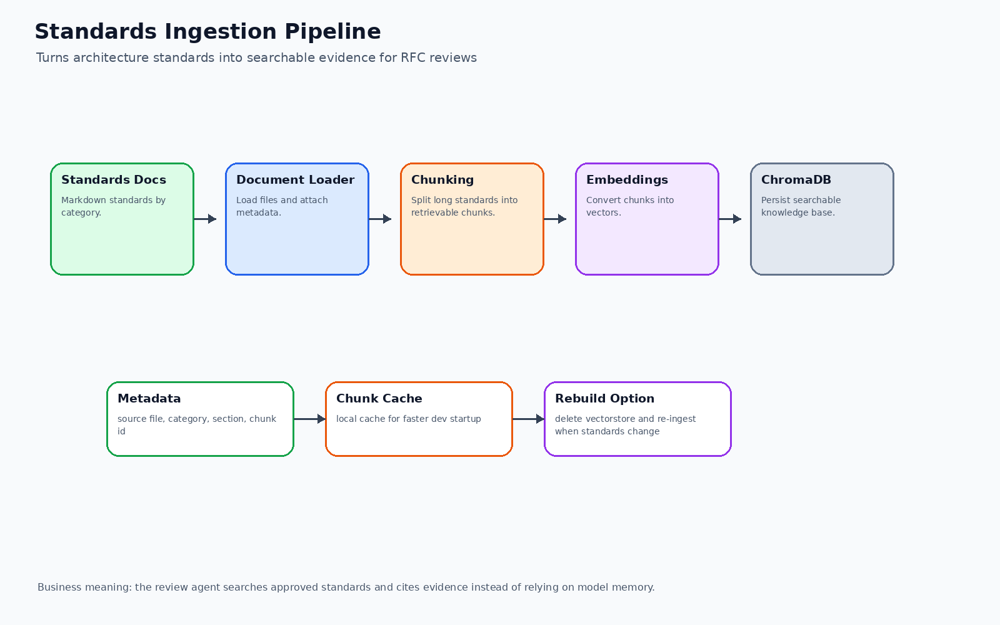
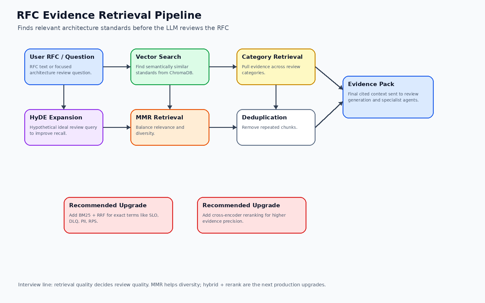
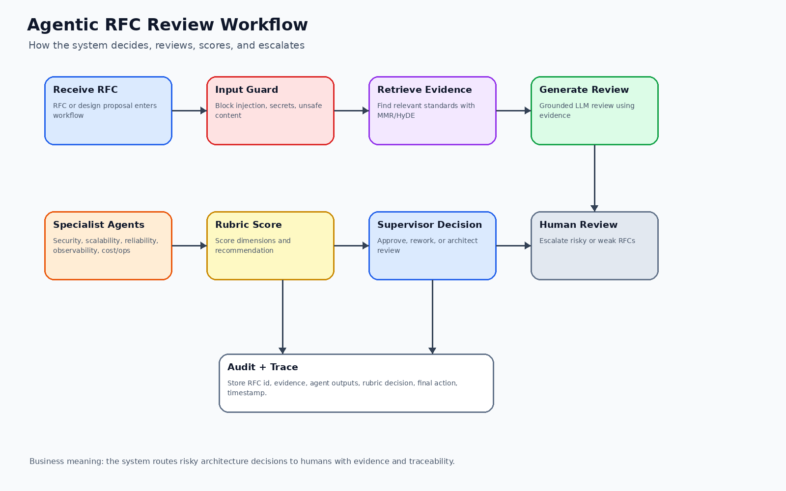
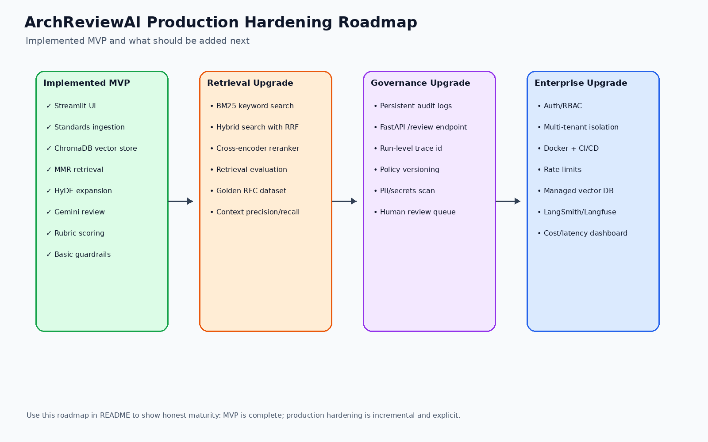
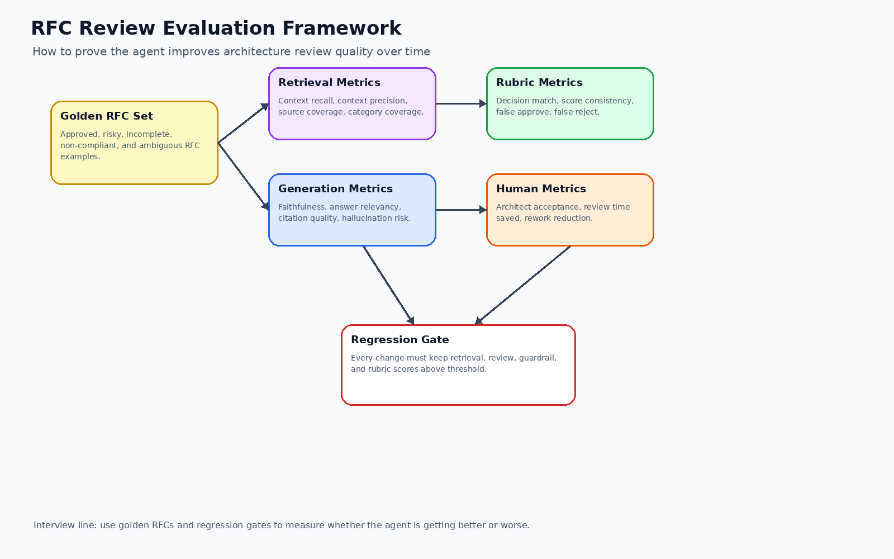

# The ArchReviewAI RFC Agent Project

## Phase 1 Agentic RAG Systems: Architecture Review Intelligence

### A Learner-Focused Journey into Production Agentic RAG for RFC Review

Learn to build a modern AI architecture review assistant from the ground up through hands-on implementation.

Master the most in-demand AI engineering skills: RAG, embeddings, vector databases, MMR retrieval, HyDE query expansion, prompt engineering, context engineering, guardrails, rubric scoring, specialist agents, supervisor decisioning, evaluation foundations, auditability, production roadmap, and Agentic RAG.


---

## System Architecture



---

## About This Course

This is a learner-focused project where you build an AI-powered RFC review assistant that reads architecture proposals, retrieves relevant enterprise standards, applies review rubrics, runs specialist review logic, and recommends whether the RFC should be approved, reworked, or escalated to a senior architect.

ArchReviewAI teaches you to build a production-style Agentic RAG system using practical engineering patterns. Unlike basic “chat with documents” demos, this project follows a professional architecture-review flow: ingest standards, chunk and embed them, retrieve relevant evidence, generate a grounded review, score the RFC with deterministic rubrics, apply guardrails, route decisions through a supervisor, and expose results in a review dashboard.

> The Professional Difference: We build Agentic RAG systems the way enterprise architecture teams need them — evidence-first, standards-grounded, rubric-driven, explainable, and escalation-aware.

By the end of this project, you will have your own AI-powered RFC review assistant and the technical skills to explain production Agentic RAG systems for architecture governance, platform engineering, and enterprise design review.

---

## What You'll Build

* Week 1: Application foundation with Streamlit, Python environment, project structure, sample RFCs, and architecture standards
* Week 2: Standards ingestion pipeline for architecture review documents
* Week 3: Vector retrieval, MMR retrieval, HyDE-style query expansion, category retrieval, and deduplication
* Week 4: Grounded RFC review generation using Gemini and retrieved standards
* Week 5: Rubric scoring, supervisor recommendation, quality gates, and downloadable review report
* Week 6: Specialist agents for security, scalability, reliability, observability, cost, and operations
* Week 7: Production hardening layer with evaluation framework, auditability roadmap, API roadmap, retrieval roadmap, guardrails, and CI/CD readiness

---

## System Architecture Evolution

### Week 7: Agentic RAG for RFC Architecture Review


Complete architecture showing how the RFC review assistant connects the Streamlit dashboard, standards ingestion layer, ChromaDB vector store, evidence retrieval, Gemini review generation, specialist agents, rubric scoring, supervisor decisioning, evaluation framework, and production hardening roadmap.

---

### Standards Ingestion Pipeline



The ingestion pipeline turns enterprise architecture standards into searchable evidence. Standards are loaded, chunked, enriched with metadata, embedded, and stored in a local ChromaDB vector store.

---

### RFC Evidence Retrieval Pipeline



The retrieval pipeline finds the most relevant architecture standards for the RFC under review. It uses semantic retrieval, MMR diversity, HyDE-style query expansion, category-wise retrieval, and deduplication to create the final evidence pack.

---

### Agentic RFC Review Workflow



The workflow shows how an RFC moves through input guardrails, evidence retrieval, grounded review generation, specialist checks, rubric scoring, supervisor decisioning, human review escalation, and audit trace creation.

Key innovations:

* Evidence-first review: the system reviews RFCs against approved architecture standards
* Specialist reasoning: security, reliability, observability, scalability, and operational gaps are reviewed separately
* Rubric scoring: deterministic scoring reduces over-reliance on the LLM
* Supervisor decisioning: final recommendation is routed through explicit decision logic
* Human escalation: weak, risky, or non-compliant RFCs are escalated instead of blindly approved
* Traceability: retrieved evidence, review reasoning, quality gates, and final decision are visible in the dashboard

---

### Production Hardening Roadmap



The production hardening roadmap shows how the MVP evolves into an enterprise-ready system with stronger retrieval, evaluation, audit logging, API integration, auth/RBAC, CI/CD, and observability.

---

### Evaluation Framework



The evaluation framework defines how RFC review quality can be measured using golden RFCs, retrieval metrics, generation metrics, rubric decision matching, human acceptance, and regression gates.

---

## Quick Start

### Prerequisites

* Python 3.12+
* Git
* Google Gemini API key
* 4GB+ RAM recommended
* Windows, macOS, or Linux

---

### Get Started

```bash
# 1. Clone and setup
git clone https://github.com/punamsahu1-spec/multi-agent-rag-architecture-review.git
cd multi-agent-rag-architecture-review
# 2. Create virtual environment
python -m venv venv
venv\Scripts\activate

# 3. Install dependencies
pip install -r requirements.txt

# 4. Configure environment
copy .env.example .env
```

For macOS/Linux:

```bash
python -m venv venv
source venv/bin/activate
pip install -r requirements.txt
cp .env.example .env
```

Update `.env` with your own local key:

```env
GOOGLE_API_KEY=your_google_api_key_here
```

Important:

```text
Never commit .env to GitHub.
Only .env.example should be tracked.
```

Run standards ingestion:

```bash
python agents/ingest_agent.py
```

Run the dashboard:

```bash
streamlit run ui/streamlit_app.py
```

---

## Weekly Learning Path

| Week   | Topic                                                                                           | Status     | Code Area                                                                    |
| ------ | ----------------------------------------------------------------------------------------------- | ---------- | ---------------------------------------------------------------------------- |
| Week 1 | [Infrastructure Foundation](#week-1-infrastructure-foundation-)                                 | ✅ Complete | `ui/`, `agents/`, `sample_rfcs/`, `standards_docs/`, `requirements.txt`      |
| Week 2 | [Standards Ingestion Pipeline](#week-2-standards-ingestion-pipeline-)                           | ✅ Complete | `agents/ingest_agent.py`, `standards_docs/`, ChromaDB                        |
| Week 3 | [RFC Evidence Retrieval](#week-3-rfc-evidence-retrieval-)                                       | ✅ Complete | `agents/retrieval_agent.py`, `agents/category_retrieval_agent.py`, MMR, HyDE |
| Week 4 | [Grounded RFC Review Generation](#week-4-grounded-rfc-review-generation-)                       | ✅ Complete | `agents/review_agent.py`, `prompts/`                                         |
| Week 5 | [Rubric Scoring and Supervisor Decisioning](#week-5-rubric-scoring-and-supervisor-decisioning-) | ✅ Complete | `agents/rubric_agent.py`, `agents/supervisor_agent.py`                       |
| Week 6 | [Specialist Agents and Dashboard](#week-6-specialist-agents-and-dashboard-)                     | ✅ Complete | `agents/specialist_agents.py`, `ui/streamlit_app.py`                         |
| Week 7 | [Production Hardening Roadmap](#week-7-production-hardening-roadmap-)                           | ✅ Complete | Evaluation framework, roadmap, guardrails, production checklist              |

---

## Access Your Services

| Service             | URL / Command                       | Purpose                                       |
| ------------------- | ----------------------------------- | --------------------------------------------- |
| Streamlit Dashboard | `http://localhost:8501`             | User-friendly RFC review interface            |
| Standards Ingestion | `python agents/ingest_agent.py`     | Load architecture standards into vector store |
| RFC Review UI       | `streamlit run ui/streamlit_app.py` | Run full review demo                          |
| Sample RFCs         | `sample_rfcs/`                      | Test architecture proposal examples           |
| Standards Docs      | `standards_docs/`                   | Architecture governance knowledge base        |
| Vector Store        | Local ChromaDB folder               | Persistent standards retrieval store          |
| Future API Docs     | `http://127.0.0.1:8000/docs`        | Planned enterprise API layer                  |

---

## Week 1: Infrastructure Foundation ✅

Start here. Master the application foundation that powers modern Agentic RAG review systems.

### Learning Objectives

* Set up a clean Python project for an AI architecture review assistant
* Organize RFC samples, standards documents, prompts, agents, and UI
* Create a Streamlit dashboard for interactive review
* Keep architecture review logic separate from UI logic
* Prepare local environment and API-key configuration
* Use professional Git hygiene for generated files and secrets

### Architecture Overview


Infrastructure components:

* Streamlit: user-facing architecture review dashboard
* Agents folder: review, retrieval, rubric, guardrail, supervisor, and specialist logic
* Standards docs: enterprise architecture rules and review guidelines
* Sample RFCs: test documents for architecture review
* Prompts: review instructions, checklist prompts, and system prompts
* Local runtime: Python virtual environment and dependency management

### Setup Guide

```bash
python -m venv venv
venv\Scripts\activate
pip install -r requirements.txt
copy .env.example .env
```

### Completion Guide

* Confirm the repo has `agents/`, `ui/`, `prompts/`, `sample_rfcs/`, and `standards_docs/`
* Confirm dependencies install successfully
* Confirm dashboard starts with `streamlit run ui/streamlit_app.py`
* Confirm `.env` is local only and `.env.example` is tracked

### Deep Dive

The most important production design choice in Week 1 is separation of concerns. The UI should display reviews, but not own the review logic. Retrieval, review generation, guardrails, rubric scoring, supervisor decisioning, and specialist review remain separate modules.

---

## Week 2: Standards Ingestion Pipeline ✅

Building on Week 1 infrastructure: learn to process enterprise architecture standards into a searchable review knowledge base.

### Learning Objectives

* Load architecture standards from markdown documents
* Split standards into retrievable chunks
* Attach metadata for source and category traceability
* Generate embeddings for architecture standards
* Persist processed chunks in ChromaDB
* Prepare the standards knowledge base for RFC review-time retrieval

### Architecture Overview


Standards ingestion components:

| Component             | Current Implementation                                |
| --------------------- | ----------------------------------------------------- |
| Standards Docs Loader | Loads markdown standards from `standards_docs/`       |
| Chunking              | Splits long standards into smaller retrievable chunks |
| Metadata              | Tracks source file, category, and chunk information   |
| Embedding Model       | Uses Gemini-compatible embedding flow                 |
| Vector Store          | Persists searchable standards in ChromaDB             |
| Rebuild Flow          | Standards can be re-ingested when policies change     |

### Implementation Guide

```bash
python agents/ingest_agent.py
```

### Completion Guide

* Standards documents load successfully
* Chunks are created from architecture standards
* Metadata is attached for traceability
* Vector store is created locally
* Retrieval agent can search the ingested standards

### Deep Dive

Better ingestion creates better architecture review. Poorly chunked standards lead to weak retrieval, which leads to weak review recommendations. ArchReviewAI treats architecture standards as the source of truth and uses the LLM only to synthesize review findings from retrieved evidence.

---

## Week 3: RFC Evidence Retrieval ✅

Building on Week 2 ingestion: add retrieval that finds relevant architecture standards for each RFC.

### Learning Objectives

* Retrieve standards relevant to the RFC under review
* Use vector search for semantic matching
* Use MMR to avoid duplicate chunks
* Use HyDE-style query expansion to improve recall
* Retrieve category-specific evidence across security, reliability, observability, rollback, cost, and operations
* Deduplicate retrieved evidence before review generation

### Architecture Overview


RFC retrieval components:

| Component            | Current Implementation                               |
| -------------------- | ---------------------------------------------------- |
| Vector Search        | Retrieves semantically similar standards             |
| MMR Retrieval        | Balances relevance and diversity                     |
| HyDE Query Expansion | Improves recall by generating an idealized query     |
| Category Retrieval   | Pulls evidence across review categories              |
| Deduplication        | Removes repeated chunks from final evidence          |
| Evidence Pack        | Sends final standards context into review generation |

### Setup Guide

```bash
python agents/ingest_agent.py
streamlit run ui/streamlit_app.py
```

### Completion Guide

* Ask the system to review a sample RFC
* Verify retrieved standards appear in the evidence explorer
* Confirm evidence covers multiple architecture categories
* Confirm repeated chunks are reduced before review generation

### Deep Dive

Retrieval quality decides review quality. MMR improves diversity by avoiding near-duplicate chunks. HyDE improves recall by expanding weak RFC text into a stronger retrieval query. Category retrieval improves coverage across architecture dimensions.

---

## Week 4: Grounded RFC Review Generation ✅

Building on Week 3 retrieval: use the LLM to generate an architecture review grounded in retrieved standards.

### Learning Objectives

* Build a review prompt using RFC text and retrieved standards
* Use Gemini to generate an architecture review
* Ground findings in retrieved evidence
* Identify risks, gaps, missing controls, and architectural weaknesses
* Apply output guardrails before displaying the review
* Produce a review that is useful for architects and engineering teams

### Architecture Overview


Grounded review components:

* RFC input: architecture proposal to be reviewed
* Evidence pack: retrieved architecture standards
* Prompt templates: system, checklist, and user review prompt
* Gemini review generation: LLM-generated review based on standards
* Guardrails: input and output safety checks
* Dashboard: final review, evidence, and trace visibility

### Setup Guide

```bash
streamlit run ui/streamlit_app.py
```

### Completion Guide

* Select or paste a sample RFC
* Run the review
* Confirm the review mentions architecture gaps
* Confirm the review references retrieved evidence
* Confirm unsafe or sensitive output is redacted where applicable

### Deep Dive

The LLM is not the architecture authority. The standards knowledge base is the authority. The LLM’s role is to synthesize a clear review from the retrieved architecture standards and RFC content.

---

## Week 5: Rubric Scoring and Supervisor Decisioning ✅

Building on Week 4 review generation: add deterministic scoring and decision routing.

### Learning Objectives

* Score RFC quality across review dimensions
* Separate deterministic rubric scoring from LLM text generation
* Create a final recommendation for approve, rework, or architect review
* Identify missing controls and weak architecture areas
* Use supervisor logic to make the final decision explainable

### Architecture Overview


Rubric and supervisor components:

| Component           | Current Implementation                            |
| ------------------- | ------------------------------------------------- |
| Security Score      | Checks security and risk signals                  |
| Scalability Score   | Checks scale and performance readiness            |
| Reliability Score   | Checks resilience and failure handling            |
| Observability Score | Checks logging, metrics, tracing, and alerting    |
| Rollback Readiness  | Checks deployment safety and rollback planning    |
| Cost / Operations   | Checks operational and cost-awareness signals     |
| Supervisor Decision | Converts signals into final review recommendation |

### Setup Guide

```bash
streamlit run ui/streamlit_app.py
```

### Completion Guide

* Run a review on a weak RFC
* Confirm rubric score is shown
* Confirm supervisor recommendation is shown
* Confirm quality gates are visible
* Confirm weak RFCs are not blindly approved

### Deep Dive

Rubric scoring makes the system more predictable. LLM output can vary, but deterministic rubric checks help create consistent review decisions. This is important for architecture governance because the team needs explainable decisions, not only fluent text.

---

## Week 6: Specialist Agents and Dashboard ✅

Building on Week 5 supervisor decisioning: add specialist review perspectives and a dashboard that exposes review evidence.

### Learning Objectives

* Add specialist review checks for key architecture dimensions
* Separate security, scalability, reliability, observability, and operational concerns
* Display evidence and quality gates in the UI
* Show agent trace and supervisor recommendation
* Provide a downloadable review report
* Make the demo understandable for architecture leaders and engineering teams

### Architecture Overview


Specialist agent components:

* Security specialist: checks authentication, authorization, secrets, and sensitive-data concerns
* Scalability specialist: checks load, performance, capacity, and scaling assumptions
* Reliability specialist: checks failure modes, retries, fallback, and resilience
* Observability specialist: checks logs, metrics, traces, alerts, and runbooks
* Cost / operations specialist: checks cost awareness and operational readiness
* Supervisor: combines specialist signals with rubric results

Dashboard components:

* RFC review tab
* Evidence explorer
* Architecture view
* Rubric score
* Supervisor recommendation
* Quality gates
* Downloadable review report

### Setup Guide

```bash
streamlit run ui/streamlit_app.py
```

### Completion Guide

* Open the dashboard
* Review a sample RFC
* Inspect retrieved evidence
* Review rubric score and supervisor decision
* Download the review report

### Deep Dive

A serious architecture review assistant should not hide its reasoning. The dashboard exposes evidence, trace, quality gates, and decision signals so that humans can trust, challenge, and improve the review.

---

## Week 7: Production Hardening Roadmap ✅

Building on Week 6 dashboard and specialist review: prepare the project for stronger production-grade architecture.

### Learning Objectives

* Understand what separates an MVP from production Agentic RAG
* Define evaluation with golden RFC test cases
* Define persistent audit logging
* Define a FastAPI backend for enterprise integration
* Define stronger retrieval using hybrid search and reranking
* Strengthen guardrails and policy checks
* Prepare CI/CD and automated regression tests

### Architecture Overview


Production hardening components:

| Component                | Current Status |
| ------------------------ | -------------- |
| Streamlit UI             | ✅ Complete     |
| Standards Ingestion      | ✅ Complete     |
| ChromaDB Vector Store    | ✅ Complete     |
| MMR Retrieval            | ✅ Complete     |
| HyDE Query Expansion     | ✅ Complete     |
| Category Retrieval       | ✅ Complete     |
| Deduplication            | ✅ Complete     |
| Gemini Review Generation | ✅ Complete     |
| Rubric Scoring           | ✅ Complete     |
| Supervisor Decisioning   | ✅ Complete     |
| Specialist Agents        | ✅ Complete     |
| Basic Guardrails         | ✅ Complete     |
| Evaluation Framework     | ✅ Complete     |
| Production Roadmap       | ✅ Complete     |
| API Roadmap              | ✅ Complete     |
| Auditability Roadmap     | ✅ Complete     |
| CI/CD Readiness Plan     | ✅ Complete     |

### Evaluation Framework


Evaluation components:

| Metric Area           | Purpose                                                                             |
| --------------------- | ----------------------------------------------------------------------------------- |
| Retrieval Recall      | Checks whether relevant standards are retrieved                                     |
| Context Precision     | Checks whether retrieved chunks are useful                                          |
| Category Coverage     | Checks whether security, reliability, observability, cost, and rollback are covered |
| Faithfulness          | Checks whether review findings are supported by evidence                            |
| Rubric Decision Match | Checks whether system decision matches expected expert decision                     |
| Human Acceptance      | Checks whether architects accept the review output                                  |

### Setup Guide

```bash
# Evaluation and production hardening reference flow
python agents/ingest_agent.py
streamlit run ui/streamlit_app.py
```

### Completion Guide

* Evaluation framework is documented
* Production hardening roadmap is documented
* API roadmap is documented
* Auditability roadmap is documented
* Retrieval improvement roadmap is documented
* CI/CD readiness plan is documented

### Deep Dive

Week 7 is the bridge from strong MVP to production-grade system. The current project demonstrates Agentic RAG concepts and documents the next maturity path. The system is ready to be extended into full enterprise deployment using the roadmap.

---

## Reference and Development Guide

### Tech Stack

| Layer              | Technology                 | Purpose                                          |
| ------------------ | -------------------------- | ------------------------------------------------ |
| Language           | Python 3.12+               | Core application language                        |
| UI                 | Streamlit                  | Interactive RFC review dashboard                 |
| LLM                | Gemini                     | Grounded review generation                       |
| Embeddings         | Gemini / embedding model   | Semantic representation of standards             |
| Vector Store       | ChromaDB                   | Local vector database                            |
| Retrieval          | Vector search + MMR        | Standards evidence retrieval                     |
| Query Expansion    | HyDE                       | Improves retrieval recall                        |
| Category Retrieval | Custom Python logic        | Improves coverage across architecture dimensions |
| Deduplication      | Custom Python logic        | Reduces repeated evidence                        |
| Guardrails         | Custom Python checks       | Prompt injection and output safety               |
| Review Agent       | Gemini + prompts           | RFC review generation                            |
| Rubric Agent       | Deterministic scoring      | Consistent architecture quality scoring          |
| Supervisor Agent   | Rule-based decisioning     | Final approve/rework/human review recommendation |
| Specialist Agents  | Custom agents              | Dimension-specific review checks                 |
| Evaluation         | Documented framework       | Regression and quality roadmap                   |
| API                | Documented FastAPI roadmap | Future enterprise service layer                  |

---

## Project Structure

```text
archreviewai-rfc-agent/
  agents/
    category_retrieval_agent.py
    guardrail_agent.py
    ingest_agent.py
    retrieval_agent.py
    review_agent.py
    rubric_agent.py
    specialist_agents.py
    supervisor_agent.py
  prompts/
    checklist_prompt.txt
    system_prompt.txt
    user_prompt_template.txt
  sample_rfcs/
    sample_good_rfc.md
    sample_risky_rfc.md
    sample_incomplete_rfc.md
  standards_docs/
    security_standards.md
    reliability_standards.md
    observability_standards.md
    rollback_standards.md
    cost_operations_standards.md
  tests/
  ui/
    streamlit_app.py
  docs/
    images/
      archreviewai_architecture.png
      standards_ingestion_pipeline.png
      rfc_retrieval_pipeline.png
      agentic_rfc_review_workflow.png
      production_hardening_roadmap.png
      evaluation_framework.png
  .env.example
  .gitignore
  requirements.txt
  README.md
```

Generated local files should be ignored by Git:

```text
vectorstore/
chroma_db/
logs/
.env
__pycache__/
*.pyc
```

---

## API Endpoint Reference

The current project is Streamlit-first. A FastAPI layer is part of the production roadmap for enterprise-style integration.

Planned endpoints:

| Endpoint   | Method | Purpose                            |
| ---------- | ------ | ---------------------------------- |
| `/`        | GET    | Root service information           |
| `/health`  | GET    | Health check                       |
| `/docs`    | GET    | FastAPI interactive documentation  |
| `/review`  | POST   | Submit RFC for architecture review |
| `/metrics` | GET    | Review quality and usage metrics   |

Planned `/review` request body:

```json
{
  "rfc_id": "RFC-001",
  "rfc_text": "Architecture proposal text...",
  "review_mode": "full",
  "user_id": "demo_user"
}
```

Planned `/review` response body:

```json
{
  "rfc_id": "RFC-001",
  "review_summary": "Architecture review summary...",
  "rubric_score": "6/10",
  "decision": "ARCHITECT_REVIEW",
  "retrieved_sources": ["security_standards.md", "observability_standards.md"],
  "specialist_findings": {
    "security": "Needs stronger auth and secret handling.",
    "observability": "Missing tracing and alerting plan."
  },
  "human_review_required": true
}
```

---

## Essential Commands

```bash
# Create virtual environment
python -m venv venv

# Activate on Windows
venv\Scripts\activate

# Activate on macOS/Linux
source venv/bin/activate

# Install dependencies
pip install -r requirements.txt

# Create env file
copy .env.example .env

# Run standards ingestion
python agents/ingest_agent.py

# Run dashboard
streamlit run ui/streamlit_app.py

# Check Git status
git status
```

Recommended compile check:

```bash
python -m py_compile agents/ingest_agent.py
python -m py_compile agents/retrieval_agent.py
python -m py_compile agents/review_agent.py
python -m py_compile agents/rubric_agent.py
python -m py_compile agents/supervisor_agent.py
python -m py_compile agents/specialist_agents.py
python -m py_compile ui/streamlit_app.py
```

---

## Target Audience

This project is designed for:

* AI engineers learning Agentic RAG
* Solution architects learning GenAI architecture review automation
* Platform engineers building internal developer productivity tools
* Enterprise architects improving RFC governance
* Engineering leaders reducing design review rework
* Learners who want a weekend-buildable but serious GenAI portfolio project

---

## Troubleshooting

| Problem                              | Likely Cause                        | Fix                                                |
| ------------------------------------ | ----------------------------------- | -------------------------------------------------- |
| Gemini call fails                    | Missing or invalid `GOOGLE_API_KEY` | Update `.env` with a valid key                     |
| Streamlit cannot import agents       | Wrong working directory             | Run from repo root                                 |
| Retrieval gives weak evidence        | Standards not ingested              | Run `python agents/ingest_agent.py`                |
| Vector store is stale                | Old local ChromaDB files            | Delete local vector store and re-ingest            |
| Review is generic                    | Retrieved evidence is weak          | Improve standards docs or add hybrid retrieval     |
| Prompt-injection test is not blocked | Guardrail pattern library is basic  | Extend `guardrail_agent.py`                        |
| README images do not show            | PNG files missing or path mismatch  | Put PNGs under `docs/images/` with exact filenames |
| Python file fails to run             | Formatting or import issue          | Run `python -m py_compile` checks                  |

---

## Cost Structure

ArchReviewAI is designed to run with minimal cost.

| Component                   | Cost                 |
| --------------------------- | -------------------- |
| Python                      | Free                 |
| Streamlit local app         | Free                 |
| ChromaDB local vector store | Free                 |
| MMR retrieval               | Free locally         |
| Guardrails                  | Free locally         |
| Rubric scoring              | Free locally         |
| Gemini API                  | Depends on API usage |
| GitHub hosting              | Free for public repo |

Recommended low-cost usage:

* Use small RFCs and standards docs during development
* Keep top-k retrieval small
* Use MMR to reduce repeated evidence
* Add caching before scaling repeated reviews
* Track token usage when moving beyond demo mode

---

## Security Notes

* Do not commit `.env`
* Use `.env.example` for placeholders only
* Rotate API keys if they were ever committed
* Keep vector stores, logs, generated reports, and cache files out of Git
* Add PII and secrets scanning before using real RFCs
* Add RBAC before using this with enterprise architecture documents
* Add policy versioning so reviews are tied to the standard version used

Recommended `.gitignore` entries:

```gitignore
.env
.env.*
!.env.example

venv/
.venv/
__pycache__/
*.pyc

vectorstore/
chroma_db/
logs/
reports/
*.pkl
```

---

## Known Limitations

ArchReviewAI is a portfolio-grade Agentic RAG prototype, not a full enterprise deployment.

Current limitations:

* Uses sample RFCs and sample architecture standards
* Prompt-injection defense is rule-based and can be strengthened
* Retrieval is currently vector/MMR-focused; hybrid BM25 + vector retrieval can be added next
* Cross-encoder reranking can be added next
* Persistent audit logging can be upgraded from roadmap to implementation
* FastAPI service endpoint can be added for enterprise integration
* Golden RFC evaluation can be converted into an executable regression suite
* Multi-tenant access control is not yet implemented
* Full cost and latency trend dashboard can be expanded
* MCP integration is intentionally out of scope for this phase

---

## Ready to Start Your AI Journey?

ArchReviewAI helps you learn the practical implementation patterns behind modern Agentic RAG systems:

* standards ingestion for governance knowledge
* chunking and embeddings for searchable architecture rules
* vector retrieval and MMR for diverse evidence
* HyDE for better recall
* category retrieval for review coverage
* grounded generation for evidence-backed RFC review
* rubric scoring for consistent review decisions
* specialist agents for architecture dimensions
* supervisor decisioning for approve/rework/escalation
* guardrails for safety
* evaluation framework for regression thinking
* production hardening roadmap for enterprise readiness

Start with Week 1, build each layer step by step, and by Week 7 you will have a serious enterprise-grade Agentic RAG portfolio project for architecture review.

> Build the review system. Ground it in standards. Make the decision explainable.
